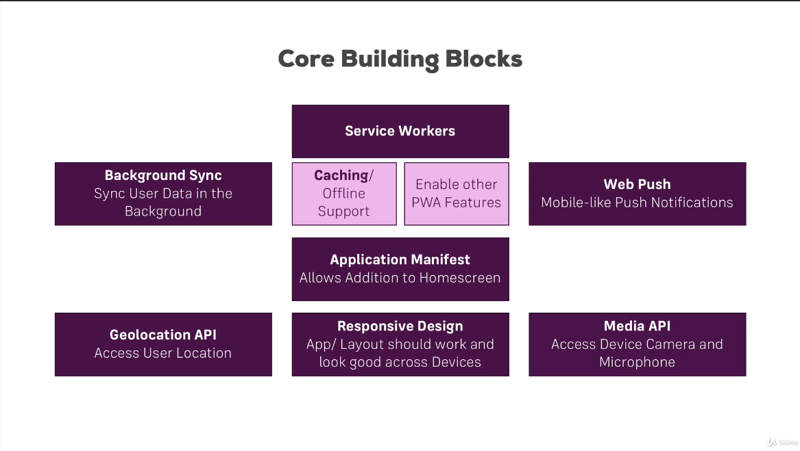

# Progressive Web Apps Course

This repo contains projects and lessons from the [Academind by Maximilian Schwarzmüller PWA Course](https://www.udemy.com/course/progressive-web-app-pwa-the-complete-guide).

## PWA Core Building Blocks

* __Service Workers__: JavaScript process running on a background (different thread) even if the application is closed. They allow to get offline access, cache files and serve them in case of no internet connection. They also give access to other PWA features such as:
  * __Background Sync__: Dispatch an event when the internet connection is reestablished.
  * __Push Notification__: Since the Service Workers can run on the background, we can use them for notifying the user. Even if the tab/app is closed.

* __Application Manifest__: Makes the application installable.

* __Responsive Design__: Adapting the design for the varying devices display sizes.

* __Geolocation API__: Allow the application to get the user location, if this is conceded.

* __Media / Streams API__: Gives access to user media interfaces such as camera and microphone.

